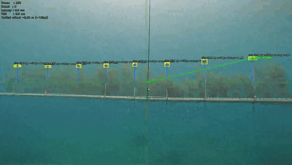

# Underwater Marker Recognition for an Autonomous ROV


Real-time computer-vision module that guides an underwater remotely-operated
vehicle (ROV) along a marked pipeline, built for the
**[NEDO Challenge for BLUE ECONOMY 2026](https://blue-economy-challenge.nedo.go.jp/)**
(Division 1: disturbance control of underwater robots).

The system detects vinyl-pipe markers in a live underwater camera feed, fuses
the camera with IMU attitude to correct for the vehicle tilting in the current,
and reports the vehicle's vertical deviation from each marker in **metres** — the
exact quantity the competition scores on. It runs as a ROS 2 node on the robot
and as a standalone CLI for offline development and evaluation.



> Real ROV footage. Yellow boxes are accepted markers, the green line/circle is
> the aggregated target the vehicle steers to, and the HUD reports per-frame
> latency and the vertical offset in metres. Detection runs in **~7 ms/frame on
> 1080p** — roughly 5× under the 33 ms (30 FPS) real-time budget.

---

## My role

I was the **sole designer and implementer of the vision/recognition module** —
this repository — as part of a university marine-robotics team's competition
entry. Everything here is my own work:

- the ROS-independent recognition pipeline: HSV + contour detection, the
  pinhole pixel→metre geometry, the IMU pitch/roll attitude fusion, MAD outlier
  rejection, and target aggregation;
- the ROS 2 node wrapping it (camera + IMU subscriptions, threaded executor,
  zero-crossing publish logic) and the offline CLI;
- the deterministic test suite, the YAML config system, and the on-site HSV
  tuning tool.

Owned by **other team members** (and consumed by this repo as dependencies, not
included here): the ROV hardware and low-level control, the camera/IMU drivers,
and the shared `*_rov_interfaces` ROS 2 message definitions.

---

## What this project demonstrates

- **Classical CV under hard conditions.** Underwater scenes lose saturation and
  contrast fast; an HSV + contour + shape-filter pipeline was deliberately chosen
  over a heavier learned detector to stay real-time on a CPU and to remain
  tunable on-site in minutes.
- **Sensor fusion.** IMU quaternions are converted to pitch/roll and applied as a
  per-frame rotation correction so the metric offset stays accurate while the
  vehicle pitches and rolls in the current.
- **Camera geometry.** A pinhole model (with optional lens-distortion calibration)
  turns pixel offsets into real-world metres, and marker size is used to recover
  depth.
- **Robust aggregation.** Multiple detections are reduced to one steering target
  via MAD-based outlier rejection and a selectable aggregation strategy.
- **Production packaging.** The same core library powers both a ROS 2 Jazzy node
  and an offline CLI, kept in sync by a small build system, with a deterministic
  test suite and static type checking.

## How it works

```text
Camera frame ──▶ ① Undistort ──▶ ② HSV threshold ──▶ ③ Morphology
                                                          │
                                                          ▼
IMU quaternion ──▶ pitch/roll ──┐               ④ Contour detection
                                │                         │
                                ▼                         ▼
                       ⑥ Pixel→metre   ◀──  ⑤ Shape filtering
                       (pinhole + tilt)        (area, circularity,
                                │               aspect, border)
                                ▼
              ⑦ MAD outlier filter ──▶ ⑧ Aggregate ──▶ ⑨ Output
                                                          ├─ Float32 vertical offset [m]
                                                          └─ Annotated debug image
```

Each stage is documented in depth — including the math for the pinhole model,
the tilt-correction rotation, and the MAD filter — in
[docs/pipeline_overview.md](docs/pipeline_overview.md).

The competition scores the **vertical deviation at the moment a marker crosses
the screen's vertical centre-line**. The ROS 2 node detects that crossing as a
sign change in the aggregated target's horizontal offset and publishes the
vertical offset in metres at exactly that instant.

## Results & performance

| Metric | Target | Achieved |
|--------|--------|----------|
| Detection latency (1080p, CPU) | ≤ 33 ms (30 FPS) | **~7 ms / frame** |
| Unit tests | — | **21 passing**, deterministic (seeded) |
| Type checking | — | **0 errors** under `pyright` |

Latency is measured per frame on a development laptop CPU (no GPU), read from the
on-screen HUD over the recorded run. The scale of the recovered geometry is
validated against the known 0.5 m
marker spacing using an SVD-fitted line through the detections
(`scale_validation.py`).

## Tech stack

- **Python 3.10+**, **OpenCV**, **NumPy**
- **ROS 2 Jazzy** (`rclpy`, `cv_bridge`, `sensor_msgs`, `std_msgs`)
- **uv** for dependency management, **pytest** + **pyright** for quality
- **colcon** for the ROS 2 workspace build

## Architecture

The recognition logic lives in a ROS-independent core library so it can be
developed and tested on a laptop, then wrapped by a thin ROS 2 node on the robot.

```text
src/vision_pipeline/          # Core, ROS-independent (the canonical source)
  config.py                   #   Typed dataclass config (YAML-loaded)
  pipeline.py                 #   VisionPipeline: detect → geometry → aggregate
  detectors/                  #   HSV contour detector + shape filtering
  sources/                    #   Camera / video-file / mock frame sources
  undistort.py                #   Lens-distortion correction
  scale_validation.py         #   Geometry sanity check vs. known spacing
  main.py                     #   Standalone CLI entry point

ros2_ws/src/nedo_vision/      # ROS 2 node (camera + IMU subscriptions, publishing)
configs/                      # YAML profiles: camera / video / mock
tests/                        # Deterministic unit tests (synthetic frames only)
tools/live_tune_hsv.py        # On-site HSV tuner for race-day re-calibration
```

The key design choice is the `camera_override` parameter on
`VisionPipeline.process_frame()`: the ROS 2 node passes a fresh `CameraConfig`
with the latest IMU-derived pitch/roll every frame, keeping real-time attitude
correction entirely out of the core algorithm.

```python
detections, target, latency_ms = pipeline.process_frame(
    frame,
    camera_override=CameraConfig(..., pitch_deg=pitch, roll_deg=roll),
)
```

## Getting started (local development, Windows/macOS/Linux)

```bash
uv sync                                                    # install dependencies
uv run python -m vision_pipeline.main --config configs/mock_hsv_baseline.yaml
uv run pytest                                              # 21 tests
uv run pyright                                             # type check
```

Run against a recorded video by pointing `source.video_path` in
`configs/video_hsv_baseline.yaml` at a file, then:

```bash
uv run python -m vision_pipeline.main --config configs/video_hsv_baseline.yaml
```

## Deploying on the robot (Ubuntu 24.04 / ROS 2 Jazzy)

```bash
source /opt/ros/jazzy/setup.bash
make build   # syncs the core library into ros2_ws/ and runs colcon build
make run     # launches recognition_node
```

### ROS 2 interface

| Direction | Topic | Type |
|-----------|-------|------|
| in | `/camera_driver/camera_image` | `sensor_msgs/Image` |
| in | `/mavlink_communicator/current_pose_acc` | ROV pose/acc (quaternion) |
| out | `<node>/difference` | `std_msgs/Float32` (vertical offset, m) |
| out | `<node>/debug_image` | `sensor_msgs/Image` (annotated) |

Full setup notes and hardware-bring-up checklist:
[docs/ros2_handover.md](docs/ros2_handover.md).

## Testing

```bash
uv run pytest
```

All tests build synthetic frames with NumPy and run under a fixed seed, so they
are fully deterministic and need no image fixtures. They cover the HSV detector,
the pinhole distance computation, the MAD outlier filter, undistortion, the
quaternion→pitch/roll conversion, and scale validation.

## Project context

This was the vision module for a university marine-robotics team's entry to the
NEDO Challenge 2026. The competition course is a 10 m submerged pipe at 5 m depth
with 19 markers at 0.5 m spacing; the ROV scores on how few markers it loses and
how small its average vertical deviation is over a timed run.

Official competition site: <https://blue-economy-challenge.nedo.go.jp/>

## License

Released under the [MIT License](LICENSE).
